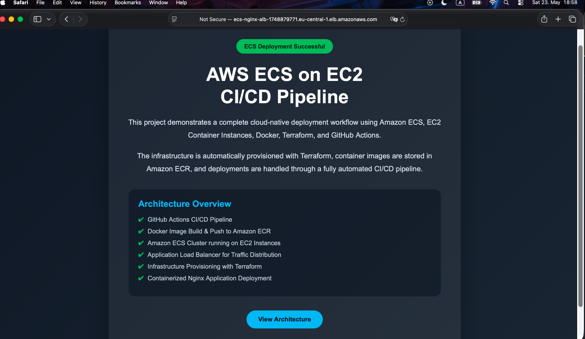
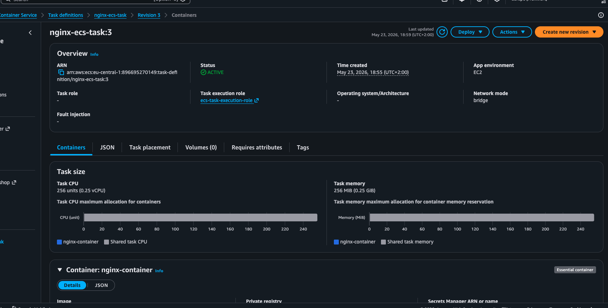
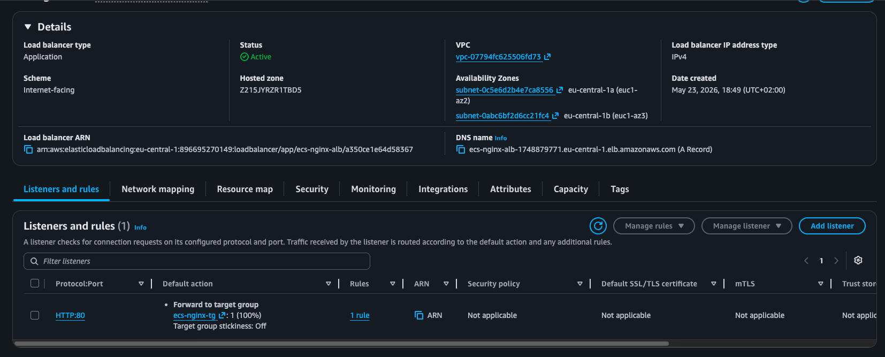

# AWS ECS on EC2 CI/CD

This project deploys a Dockerized Nginx application on **Amazon ECS using the EC2 Launch Type**.

It is an evolution of the previous EC2-based Docker deployment model [02-aws-ec2-docker-cicd](https://github.com/useruser300/02-aws-ec2-docker-ansible-cicd)  .  
The old design used SSH and Ansible to connect directly to an EC2 instance and run Docker commands manually.

The new design replaces manual container deployment with **Amazon ECS**, where ECS manages task placement, service updates, container lifecycle, and integration with the Application Load Balancer.

---

## Architecture Overview

The following diagram illustrates the overall architecture of this project, including the CI/CD pipeline, Amazon ECR, ECS Cluster, EC2 container instances, and the Application Load Balancer.


---

## Deployment Verification

The following screenshots show that the ECS deployment is working successfully.

### Application Load Balancer

The Application Load Balancer is active, internet-facing, and forwards HTTP traffic on port 80 to the ECS target group.



### ECS Task Definition

The ECS Task Definition revision is active and uses the EC2 launch type with bridge networking for the Nginx container.



### Running Application

The application is successfully reachable through the public ALB DNS name.



---

## Project Goal

The goal of this project is to deploy a containerized web application using a more production-like AWS architecture.

This project demonstrates how to:

- Provision AWS infrastructure using Terraform
- Build and push Docker images to Amazon ECR
- Run containers on Amazon ECS using EC2 Launch Type
- Use EC2 instances as ECS container capacity
- Deploy application updates through GitHub Actions
- Expose the application through an Application Load Balancer
- Send container logs to Amazon CloudWatch Logs

---

## Architecture Flow

The application is accessed through the Application Load Balancer.

```text
User
 |
Internet
 |
Application Load Balancer
 |
Target Group
 |
ECS Service
 |
ECS Task
 |
EC2 Container Instance
 |
Nginx Container
```

The CI/CD workflow works as follows:

```text
Developer Push
 |
GitHub Actions CI
 |
Build Docker Image
 |
Push Image to Amazon ECR
 |
GitHub Actions CD
 |
Register New ECS Task Definition Revision
 |
Update ECS Service
 |
ECS Rolling Deployment
```

---

## Infrastructure

The infrastructure is managed with Terraform.

Terraform creates the main AWS resources required for the project, including:

- VPC and public subnets
- Internet Gateway and route table
- Security groups
- Amazon ECR repository
- ECS Cluster
- ECS Task Definition
- ECS Service
- ECS Capacity Provider
- EC2 Launch Template
- EC2 Auto Scaling Group
- Application Load Balancer
- Target Group
- CloudWatch Log Group
- IAM roles and instance profiles
- S3 backend for Terraform state

---

## ECS on EC2 Design

This project uses **Amazon ECS with EC2 Launch Type**.

That means the containers run on EC2 instances, but the containers are not managed manually.

Instead of connecting to EC2 with SSH and running Docker commands, ECS manages the container lifecycle.

The EC2 instances act as ECS container instances inside the ECS Cluster.

```text
ECS Cluster
 |
ECS Capacity Provider
 |
Auto Scaling Group
 |
EC2 Container Instances
 |
ECS Agent
 |
ECS Tasks
 |
Nginx Containers
```

---

## Why ECS on EC2?

ECS on EC2 provides more control over the underlying compute layer compared to Fargate.

With this design:

- EC2 instances provide the compute capacity
- ECS manages task scheduling
- ECS Service keeps the desired number of tasks running
- The Capacity Provider connects ECS with the Auto Scaling Group
- The Application Load Balancer routes traffic to healthy tasks

This creates a more realistic container orchestration workflow while still keeping visibility into the EC2 infrastructure.

---

## CI/CD Workflows

The project uses three GitHub Actions workflows:

```text
infrastructure.yml
ci.yml
cd.yml
```

---

## 1. Infrastructure Workflow

File:

```text
.github/workflows/infrastructure.yml
```

This workflow runs Terraform.

It is triggered when Terraform files change:

```text
**/*.tf
terraform.tfvars
```

It performs:

```text
terraform init
terraform plan
terraform apply
```

It can also be triggered manually to destroy the infrastructure:

```text
terraform destroy
```

---

## 2. CI Workflow

File:

```text
.github/workflows/ci.yml
```

This workflow builds and pushes the Docker image to Amazon ECR.

It runs when application files change, such as:

```text
Dockerfile
*.html
*.css
*.js
*.conf
```

Each Docker image is pushed with two tags:

```text
commit-sha
latest
```

The `commit-sha` tag represents a specific version of the application.  
The `latest` tag represents the newest available image.

---

## 3. CD Workflow

File:

```text
.github/workflows/cd.yml
```

This workflow deploys the new Docker image to Amazon ECS.

It runs automatically after the CI workflow completes successfully.

It can also be triggered manually with a specific image tag.

The CD workflow performs:

```text
Read Terraform outputs
Create a new ECS task definition revision
Update the ECS service
Wait until the ECS service becomes stable
Print the application URL
```

Unlike the previous deployment model, this workflow does not use SSH or Ansible.

Deployment is done through the AWS ECS API.

---

## Deployment Flow

### First Deployment

Because the ECR repository is new at the beginning, the ECS Service is initially created with:

```text
desired_count = 0
```

This prevents ECS from trying to start a task before a Docker image exists in ECR.

The first deployment flow is:

```text
1. Run infrastructure workflow
2. Terraform creates the AWS infrastructure
3. ECS Service is created with desired_count = 0
4. Run CI workflow manually
5. CI builds and pushes the Docker image to ECR
6. CD runs automatically after CI
7. CD updates ECS Service and sets desired_count = 1
8. ECS starts the task
9. The application becomes available through the ALB URL
```

---

### Application Update

When application files are changed, the flow is:

```text
ci.yml
→ cd.yml
→ ECS rolling deployment
```

A new Docker image is built, pushed to ECR, and deployed to ECS.

---

### Infrastructure Update

When Terraform files are changed, the flow is:

```text
infrastructure.yml
```

Infrastructure changes do not automatically build a new Docker image.

If a deployment is needed after an infrastructure change, the CD workflow can be triggered manually.

---

## Application Access

The application is exposed through the Application Load Balancer.

The public URL is available from Terraform output:

```bash
terraform output application_url
```

The application is not accessed directly through the EC2 public IP.

---

## Logging

Container logs are sent to Amazon CloudWatch Logs.

The ECS Task Definition uses the AWS logs driver.

Logs are stored in:

```text
/aws/ecs/nginx-app
```

This allows container logs to be viewed without connecting directly to the EC2 instances.

---

## Security Model

The security model separates public access from container execution.

The Application Load Balancer is public and accepts HTTP traffic from the internet.

The ECS container instances only accept application traffic from the ALB Security Group.

```text
Internet
 |
ALB Security Group
 |
Application Load Balancer
 |
ECS EC2 Security Group
 |
ECS Tasks
```

SSH access is not required for deployment.

The previous SSH-based deployment model has been removed.

---

## Required GitHub Secrets

The following GitHub repository secrets are required:

```text
AWS_ACCESS_KEY_ID
AWS_SECRET_ACCESS_KEY
```

The old secret below is no longer required:

```text
EC2_PRIVATE_KEY
```

This is because deployment no longer uses SSH or Ansible.

---

## Previous Design vs Current Design

### Previous Design

```text
GitHub Actions
 |
SSH
 |
Ansible
 |
EC2 Instance
 |
docker pull
docker run
 |
Nginx Container
```

### Current Design

```text
GitHub Actions
 |
AWS ECS API
 |
ECS Service
 |
ECS Task Definition
 |
EC2 Container Instances
 |
Nginx Container
```

The current design is cleaner, more scalable, and closer to a real-world ECS deployment pattern.

---

## Final Workflow Summary

```text
Infrastructure:
Terraform creates AWS infrastructure

CI:
Build Docker image and push it to ECR

CD:
Register new ECS task definition revision and update ECS service

Runtime:
ECS runs Nginx containers on EC2 container instances

Access:
Users access the application through the Application Load Balancer
```

---

## Notes

This project is built for learning and portfolio purposes.

It demonstrates a practical migration from a manually managed EC2 Docker deployment to an ECS-managed container deployment using the EC2 Launch Type.

The main improvement is moving from:

```text
Manual container deployment on EC2
```

to:

```text
Managed container orchestration with Amazon ECS on EC2
```

