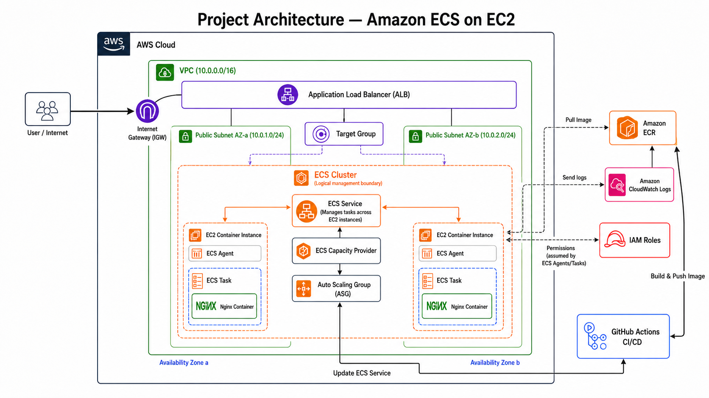

# aws-ecs-on-ec2-cicd

The following diagram illustrates the overall architecture of this project, including the CI/CD pipeline, Amazon ECR, ECS Cluster, EC2 container instances, and the Application Load Balancer.

